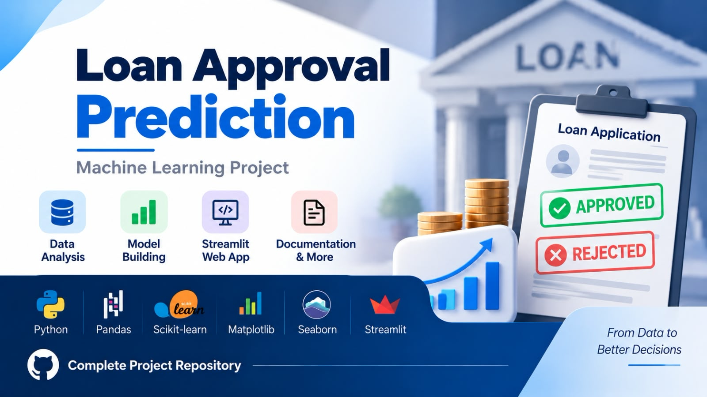
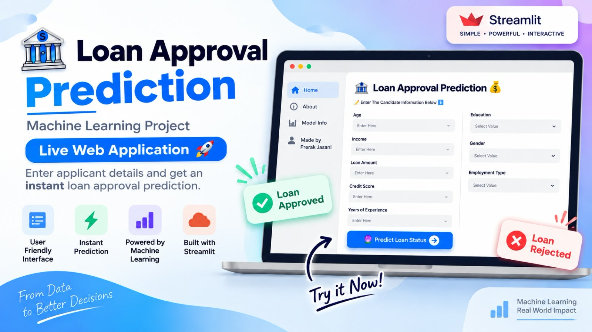

    

## 📁 Repository Contents

### `Data, Python File, Documentation`

This folder contains:

* Dataset used for the project
* Python/Jupyter Notebook files
* Project documentation

### `app.py`

The **Streamlit web application** used to create the interactive Loan Approval Prediction webpage.

### `Features.pkl`

Contains the required features used by the web application for making predictions.

### `Preprocessing and Model.pkl`

Contains the trained Machine Learning model and preprocessing pipeline used for prediction.

### `requirements.txt & runtime.txt`

Contains the Python libraries and versions required to run the web application.

## 🌐 Web Application

    

## Live Demo 

https://loan-approval-prediction--ml--project.streamlit.app/

## 🛠️ Technologies Used

* Python
* Pandas
* Scikit-learn
* Matplotlib
* Seaborn
* Streamlit
* Jupyter Notebook

## 🎯 Project Objective

The main objective of this project is to use Machine Learning to predict **loan approval** based on the given input features and provide the prediction through an easy-to-use web application.
